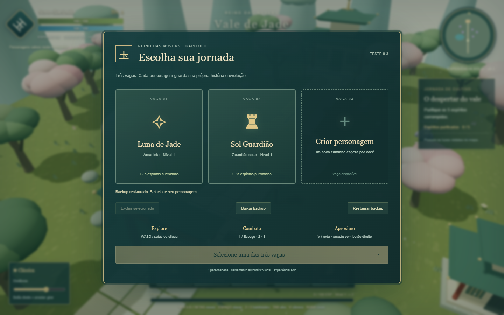
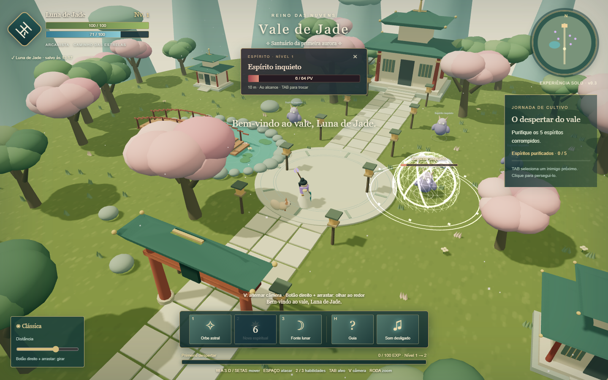

# Vale de Jade — O despertar

Protótipo 3D solo de fantasia oriental, desenvolvido em JavaScript e Three.js.
Versão **0.3**: três personagens, salvamento individual e combate com seleção de alvo.

## Jogar

Abra `index.html` no Chrome ou Edge. Não exige instalação, servidor ou conexão
com a internet. Ao baixar um ZIP, extraia todos os arquivos antes de abrir.

## Personagens e salvamento

- Três vagas independentes. Clique em uma vaga vazia para criar um personagem.
- Escolha Espadachim, Arcanista ou Guardião solar e um nome de 2 a 20 caracteres.
- Nome, classe, nível, experiência, vida, energia, posição, câmera e estado da
  missão são salvos automaticamente, a cada três segundos e nas mudanças importantes.
- O menu de pausa oferece **Salvar agora** e **Salvar e trocar personagem**.
- O perfil da versão 0.2 é migrado para a primeira vaga; o registro antigo é preservado.
- **Baixar backup** exporta as três vagas em JSON. **Restaurar backup** valida o arquivo
  e pede confirmação antes de substituir as vagas atuais.
- Excluir um personagem exige confirmação e afeta apenas a vaga selecionada.

O armazenamento é local ao navegador. Não há conta online ou sincronização em nuvem.
Limpar dados do navegador, trocar de navegador, mudar o endereço do jogo ou usar modo
privado pode afetar os saves. Use os arquivos de backup para transportar o progresso.

## Controles

| Controle | Ação |
| --- | --- |
| WASD / setas | Mover em relação à câmera |
| Clique no chão | Caminhar até o ponto |
| Clique em inimigo | Selecionar, aproximar e atacar |
| TAB | Alternar alvo próximo |
| 1 / Espaço | Ataque básico |
| 2 | Habilidade ofensiva em área |
| 3 | Cura ou proteção |
| V | Câmera clássica, aventura ou terceira pessoa |
| Roda do mouse | Aproximar / afastar |
| Botão direito + arrastar | Girar câmera |
| H / Esc | Pausa e menu |

O alvo permanece selecionado ao andar com WASD. Clique no chão ou no × do painel
para remover a seleção. A barra no topo mostra vida, distância e alcance do alvo;
outra barra acompanha o inimigo na cena.

## Classes

- **Espadachim:** sequência de três golpes, dança de lâminas e cura de jade.
- **Arcanista:** projéteis teleguiados, explosão astral e recuperação lunar.
- **Guardião solar:** lança, impacto de fogo e escudo de redução de dano.

Purifique cinco espíritos e enfrente o Guardião da névoa. Cada espírito concede
35 EXP; o chefe, 100 EXP. A experiência excedente é mantida ao subir de nível.

## Limites atuais

Protótipo para computador com teclado e mouse. Ainda não inclui multiplayer,
inventário ou missões adicionais. Cliques no chão não calculam rotas ao redor de
obstáculos; use WASD para contorná-los. A conclusão da missão também fica salva.

## Estrutura

- `index.html`: interface e carregamento.
- `style.css`: estilos e layouts.
- `game.js`: mundo 3D, personagens, câmera, combate e interface.
- `storage.js`: coleção de três personagens, validação, migração e cópia de recuperação.
- `vendor/`: Three.js 0.160.0 e sua licença MIT.

Arte procedural original; nenhum arquivo, personagem ou código de Zu Online foi
utilizado. A inspiração é a fantasia oriental dos MMORPGs clássicos.

## Verificação da versão 0.3

Testados em Chrome: criação e alternância de três personagens, recarga com progresso
preservado, exclusão isolada, exportação e restauração, rejeição de backup inválido,
migração da versão anterior, vida e manutenção do alvo, layout em 720p e conclusão
da missão com as três classes, incluindo sua retomada após recarregar.
