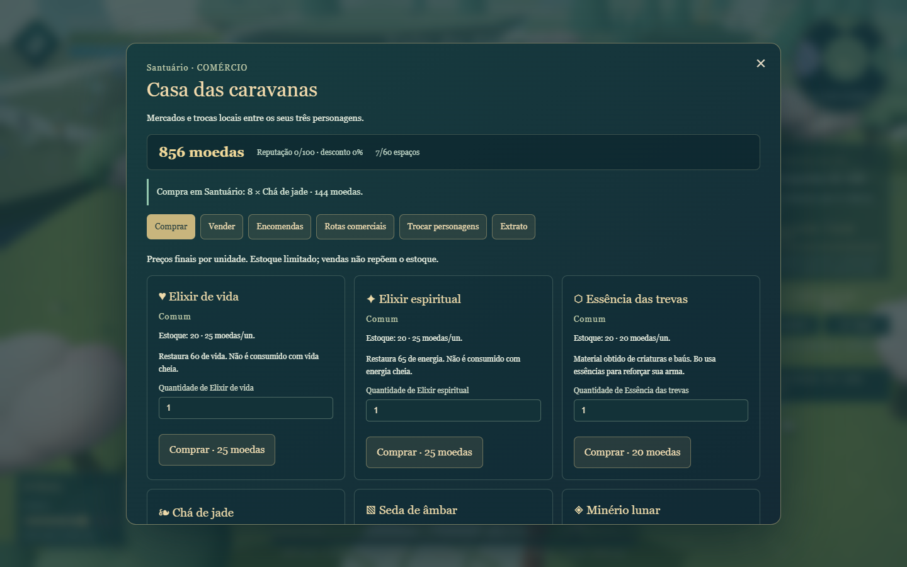
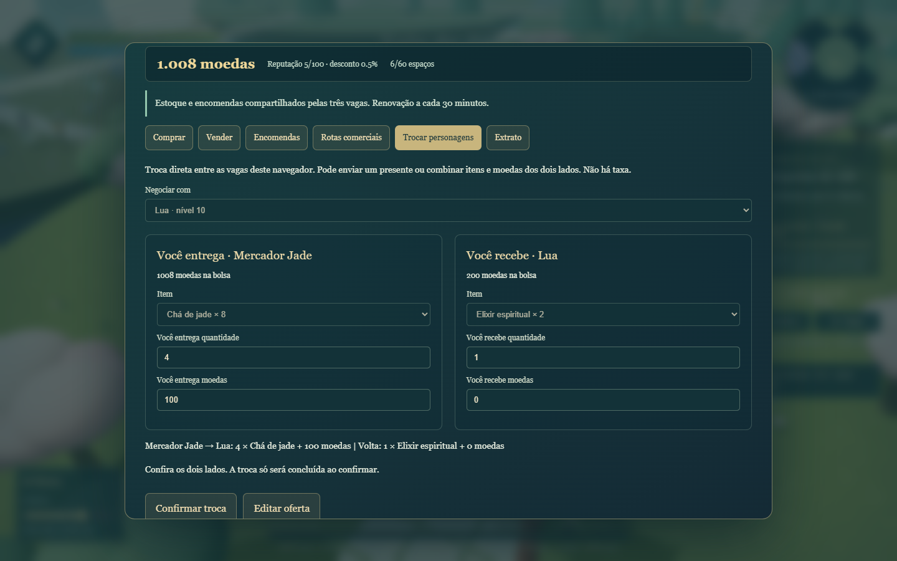
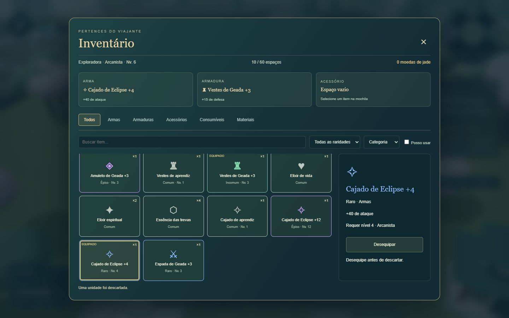
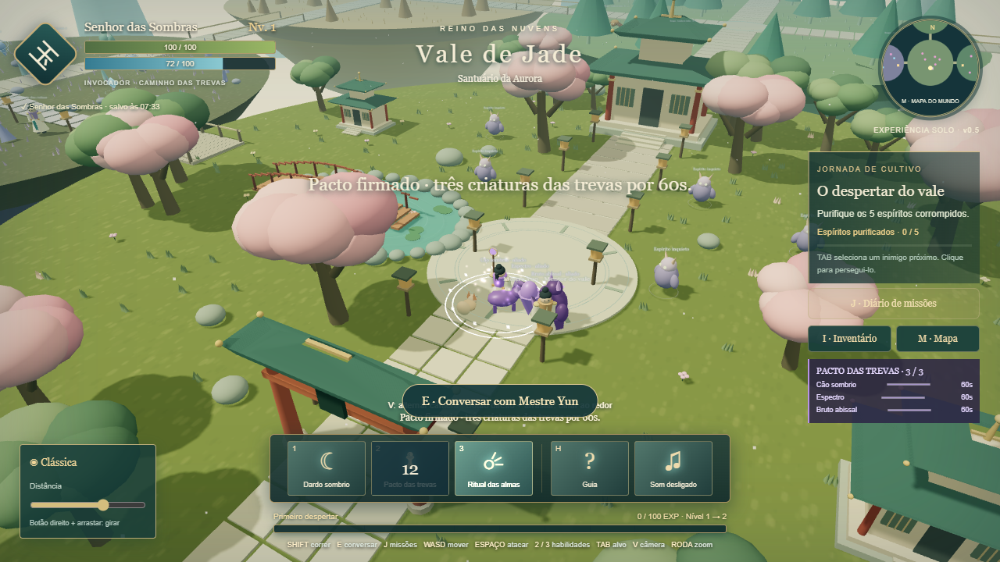
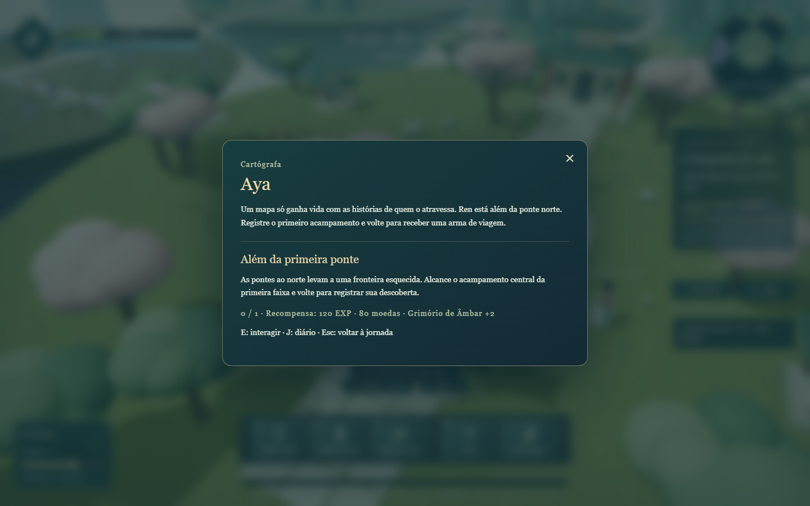
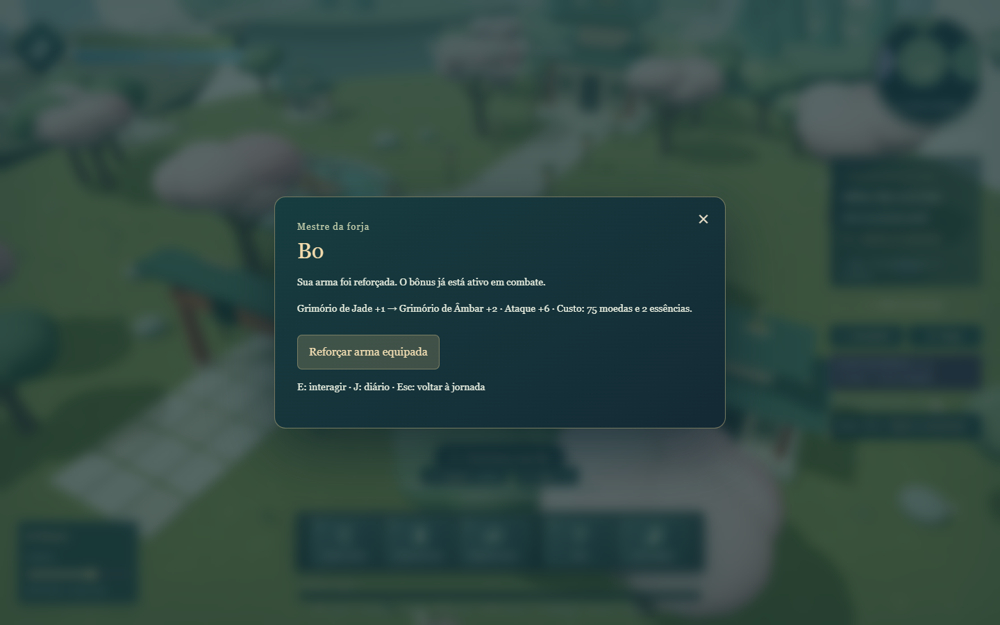
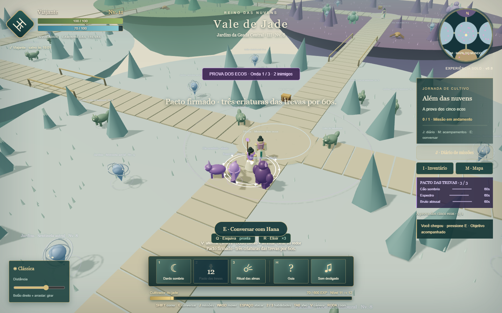

# Vale de Jade — Além das nuvens

Protótipo 3D solo de fantasia oriental, desenvolvido em JavaScript e Three.js.
**Versão 0.7:** economia regional, caravanas, encomendas e trocas entre personagens.

## Jogar

Abra `index.html` no Chrome ou Edge. Extraia o ZIP inteiro antes de abrir.
Não exige instalação, servidor ou conexão com a internet. Use teclado e mouse.
Se já estiver jogando, atualize a página para carregar a nova versão.

## Economia e comércio

Converse com **Tao** no santuário usando **E** e escolha **Abrir mercado e trocas**.
Ren, Noor, Hana e Sora também oferecem mercados nos quatro acampamentos da fronteira.
O mundo pausa durante a negociação.

- **Comprar / Vender:** quantidades, preços totais antes da compra, equipamentos regionais,
  materiais e elixires. Raridade e nível afetam o valor; uma unidade equipada fica protegida.
- **Rotas comerciais:** compre chá de jade no Santuário e venda na Geada; seda de âmbar
  em Âmbar para o Eclipse; minério lunar do Eclipse para o Santuário. Sem desconto,
  cada unidade custa 18 na origem e rende 30 no destino.
- **Encomendas:** entregue essências das trevas por moedas e reputação. A reputação
  compartilhada concede até 10% de desconto. Uma entrega por mercado a cada renovação.
- **Trocar personagens:** escolha outra vaga criada, ofereça e receba um tipo de item
  e moedas de cada lado, revise e confirme. Também permite presentes, sem taxa.
  A negociação salva as duas vagas juntas; se o salvamento falhar, ela é cancelada.
- **Extrato:** as últimas 30 negociações ficam salvas na coleção.

Estoque e encomendas são compartilhados entre as três vagas e renovados em intervalos
fixos de 30 minutos pelo relógio do dispositivo. Trocar de personagem ou recarregar
não repõe estoque dentro do mesmo intervalo. Vendas não reabastecem a loja.
As operações validam saldo, quantidade, limite de 60 espaços e 999 unidades por pilha.

Este é um jogo **solo e local**: as trocas são com NPCs ou entre os seus personagens
salvos neste navegador. Não há servidor, mercado online ou trade com outros jogadores.
Os backups da coleção incluem a economia; saves anteriores são preservados.

## Inventário

Pressione **I** ou clique em Inventário. O mundo fica pausado durante a organização.

- Abas: todos, armas, armaduras, acessórios, consumíveis e materiais.
- Busca por nome, filtro de raridade, filtro “Posso usar” e ordenação.
- 60 espaços para tipos de item, com unidades empilhadas.
- Arma, armadura e acessório equipáveis. A comparação mostra a diferença para o item atual.
- Armas aumentam o ataque; armaduras reduzem o dano recebido; acessórios acrescentam poder espiritual aos ataques e às invocações.
- Armas respeitam classe e nível. Armaduras e acessórios podem ser usados por todas as classes, respeitando o nível.
- Elixir de vida recupera 60 PV; elixir espiritual recupera 65 de energia. Recursos cheios não gastam o elixir.
- Inimigos concedem itens e moedas. A qualidade e o nível dos equipamentos acompanham a região.
- Se não houver espaço para um novo tipo de item, ele é convertido em moedas, com aviso.
- Descartar exige confirmação. Um item equipado precisa ser desequipado primeiro.

Personagens antigos recebem equipamento básico e elixires uma única vez, sem perder o progresso.
Tao e os comerciantes dos acampamentos negociam elixires, materiais e equipamentos. Bo usa moedas e essências para reforçar sua arma equipada, respeitando seu nível.

## Mundo e progressão

O santuário, a floresta de bambu e as ruínas da versão anterior continuam presentes.
Ao norte, **12 áreas procedurais** formam uma fronteira de quatro faixas conectadas
por pontes, totalizando **15 regiões** e aproximadamente 200 × 370 unidades de extensão.

- Bosque Esmeralda, Deserto de Âmbar, Jardins da Geada e Terras do Eclipse.
- Cada personagem tem uma semente própria; a mesma jornada mantém seu mapa ao recarregar.
- Biomas, raios das ilhas, vegetação e posições dos inimigos são gerados a partir dessa semente.
- 108 criaturas adicionais; até 126 inimigos no mundo, contando a jornada original e seus chefes.
- O perigo cresce com a distância ao norte: novas áreas de nível 4 a 11, com inimigos chegando ao nível 12 e elites na última faixa.
- Vida, dano, experiência e qualidade dos itens aumentam nas áreas mais distantes.
- Criaturas da fronteira retornam após 180 segundos de jogo ativo, quando você está a mais de 15 unidades do ponto de nascimento. O tempo restante também é salvo.
- Inimigos das missões originais permanecem purificados para preservar o progresso.
- As rotas principais ficam livres de vegetação. Cliques não calculam desvios; use WASD ao redor de obstáculos.
- **M** abre o mapa completo e os níveis recomendados. O minimapa acompanha a posição do jogador.

O mundo é grande e procedural, mas finito. Regiões descobertas ficam registradas separadamente por personagem.

## Classes

- **Espadachim:** combo de espada, dança de lâminas e cura de jade.
- **Arcanista:** projéteis astrais, explosão em área e cura lunar.
- **Guardião solar:** lança, impacto de fogo e escudo temporário.
- **Invocador:** dardo sombrio, pacto com criaturas e ritual das almas.

### Invocador

Crie um personagem em uma vaga vazia e escolha Invocador.

| Tecla | Habilidade |
| --- | --- |
| 1 / Espaço | Dardo sombrio: projétil a distância |
| 2 | Pacto das trevas: invoca cão sombrio, espectro e bruto abissal por 60 segundos |
| 3 | Ritual das almas: cura 30 PV do jogador, restaura os aliados e aumenta o dano deles em 60% por 8 segundos |

As criaturas seguem o personagem e priorizam o alvo selecionado. Sem alvo, defendem
seu mestre de inimigos próximos. O cão combate de perto; o espectro ataca a distância;
o bruto tem mais vida e atrai a atenção dos inimigos. Eles recebem dano, podem morrer
e mostram vida e duração no painel. Um novo pacto substitui o grupo anterior, com
limite de três aliados. O estado das invocações também fica salvo.

## Novidades de jogabilidade

- **Q: esquiva**, com deslocamento curto, 0,38 segundo de invulnerabilidade e 3 segundos de recarga. Respeita os limites e obstáculos do mapa.
- **R: elixir rápido**, usando uma unidade da mochila, com 6 segundos de recarga. Vida cheia não gasta elixir.
- **Segure 1 ou Espaço** para atacar continuamente um inimigo ao alcance.
- Fora de combate e longe dos inimigos, recupere 3 PV por segundo após 6 segundos sem combate.
- **M: viagem entre acampamentos descobertos**, disponível fora de combate e de provas.
- O objetivo acompanhado mostra direção ou distância. Escolha outra missão para acompanhar no diário J.
- **12 baús**, um por região procedural, oferecem moedas, essências e suprimentos. Alguns também contêm equipamentos raros. Cada baú abre uma vez por personagem.

## Campanha Além das nuvens

Sete novos habitantes se juntam aos três anteriores. A campanha acrescenta cinco missões conectadas, totalizando nove missões.

| Habitante | Local / atividade |
| --- | --- |
| Aya, cartógrafa | No santuário, perto do início. Pede a descoberta do primeiro acampamento e recompensa com arma rara. |
| Ren, batedor | Acampamento central da primeira faixa. Missão de combate na fronteira. |
| Noor, guardiã | Acampamento central da segunda faixa. Pede a ativação de três faróis, um em cada ilha dessa faixa. |
| Hana, mestra | Acampamento central da terceira faixa. Organiza a prova dos cinco ecos. |
| Sora, vigia | Acampamento central da última faixa. Pede a derrota de um dos três colossos da fronteira; recompensa com arma épica. |
| Tao, mercador | Santuário. Mercado de equipamentos, elixires e mercadorias; encomendas e trocas entre vagas. |
| Bo, mestre da forja | Santuário. Reforça a arma equipada usando moedas e essências, com custo e melhoria mostrados antes da ação. |

Aceite e entregue cada missão ao respectivo NPC com E. As missões seguintes são liberadas pela entrega da anterior. Vitórias anteriores na fronteira também contam. Recompensas de missão só são concedidas uma vez; baús, faróis e contadores são salvos. A entrega de equipamento exige espaço na mochila.

### Prova dos cinco ecos

Hana libera a prova após a missão dos faróis. Há três ondas: duas feras, dois espíritos e um guardião. Durante a prova, os inimigos comuns da ilha ficam suspensos para manter o desafio concentrado na arena. Você pode pausar normalmente. Sair da arena, morrer ou recarregar reinicia a tentativa; os itens e a missão são preservados. A vitória fica salva. A primeira vitória concede um bônus, e a prova pode ser repetida para obter o loot normal dos inimigos.

## Missões e habitantes originais

Mestre Yun aguarda no santuário; Lin está junto à ponte da floresta; Mei, na entrada
das ruínas. Aproxime-se e pressione **E** para conversar, aceitar ou entregar missões.
As quatro missões originais continuam disponíveis, com recompensas únicas.
A missão de Mei permite coletar três memórias de cristal e libera o desafio do Colosso.
Feitos anteriores contam para as missões de combate. **J** abre o diário e permite
retornar ao santuário.

## Controles

| Controle | Ação |
| --- | --- |
| WASD / setas | Mover em relação à câmera |
| Shift + movimento | Correr |
| Clique no chão | Caminhar até o ponto |
| Clique em inimigo | Selecionar, aproximar e atacar |
| TAB | Alternar alvo próximo |
| 1 / Espaço, 2, 3 | Habilidades da classe |
| Q / R | Esquiva / elixir rápido |
| I | Inventário |
| M | Mapa completo |
| E | Conversar / coletar memória próxima |
| J | Diário de missões |
| V / roda | Alternar câmera / ajustar distância |
| Botão direito + arrastar | Girar câmera |
| H / Esc | Pausar; Esc fecha a janela atual |

O alvo mantém a barra de vida no painel e sobre o modelo. Saia dos círculos de aviso
para evitar ataques inimigos. A experiência excedente é mantida ao subir de nível.

## Personagens e salvamento

Três vagas independentes guardam nome, classe, evolução, posição, câmera, missões,
inventário, equipamentos, inimigos, mapa, descobertas e invocações. O jogo salva
automaticamente a cada três segundos e nas mudanças importantes.

O menu de pausa oferece Salvar agora e Salvar e trocar personagem. Baixar backup
exporta as três vagas; Restaurar backup valida o arquivo e pede confirmação antes de
substituí-las. A migração preserva os personagens das versões 0.2 a 0.6.

O armazenamento é local ao navegador, sem conta online ou sincronização em nuvem.
Trocar de navegador, endereço ou computador, limpar os dados ou usar modo privado
pode afetar os saves. Use backup para transportar sua jornada.

## Verificação

Testes de regras: `node systems.test.cjs` e `node campaign.test.cjs` (Node.js, sem dependências).
Verificam geração reproduzível, biomas, posições válidas, rotas, dificuldade,
validação de itens, restrições de equipamentos e compatibilidade dos saves.

Também verificados no Chrome: três vagas, migração, exportação/restauração, seleção
de alvo, inventário e filtros, descarte, consumíveis, bônus efetivos em combate,
Invocador e combate dos aliados, pausa e retomada das invocações, mapa, travessia
até a última faixa, reaparecimento de inimigos e posições distantes após recarregar.
Interface conferida em 1440 × 900 e 1280 × 720.

A versão 0.6 também foi verificada com aceites e entregas da campanha, três faróis, recompensa final, baú sem duplicação, compras/vendas, reforço de arma, esquiva na borda, ataque contínuo, contagem de vitórias e combate real nas três ondas da arena.

## Estrutura e limites

- `index.html` / `style.css`: interface e apresentação.
- `game.js`: cena, combate, interface, missões e companheiros.
- `systems.js`: catálogo de itens e geração determinística do mundo.
- `storage.js`: validação, três personagens e cópia de recuperação.
- `campaign.js` / `campaign.test.cjs`: campanha, validação e regras da forja.
- `systems.test.cjs`: testes das regras e da compatibilidade.
- `vendor/`: Three.js 0.160.0 e licença MIT para funcionamento offline.

Ainda é um protótipo solo, sem multiplayer ou fabricação de itens do zero. Arte procedural
original; nenhum arquivo, personagem ou código de Zu Online foi utilizado.

## Verificação das regras

Com Node.js: `node systems.test.cjs`, `node campaign.test.cjs` e `node economy.test.cjs`.
Os testes da economia cobrem limites, conservação de recursos, estoque compartilhado,
recompensas únicas por renovação e cancelamento quando o armazenamento falha.
